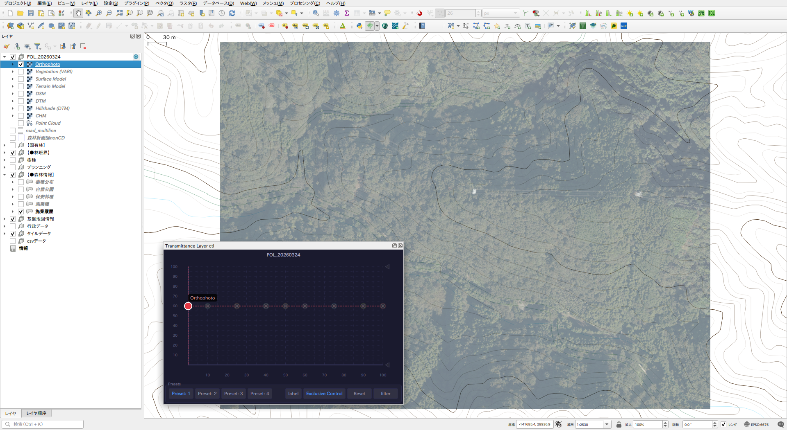
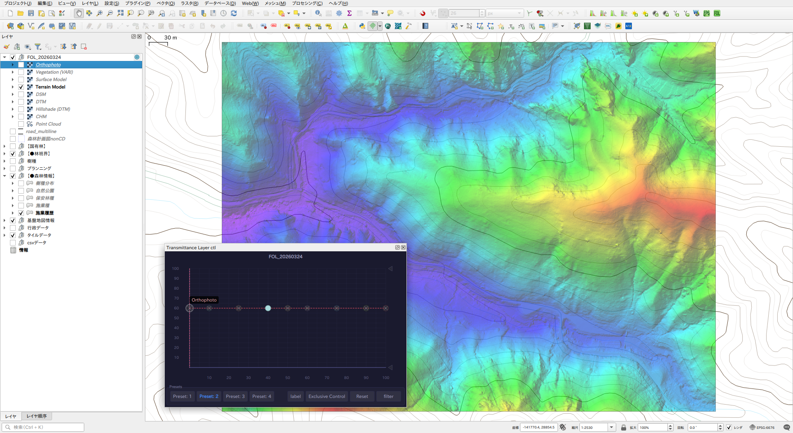
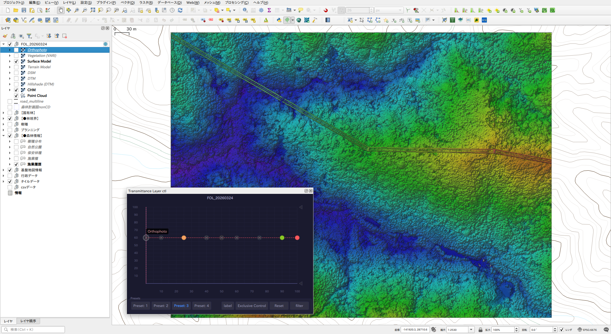
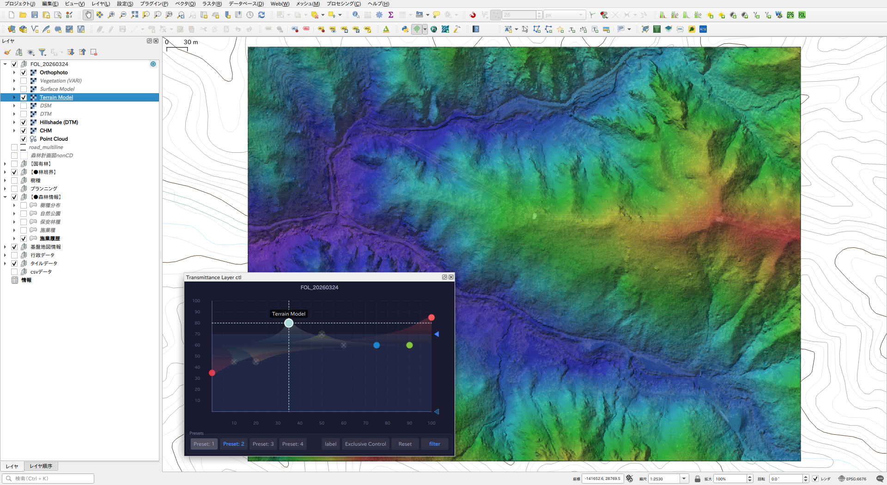
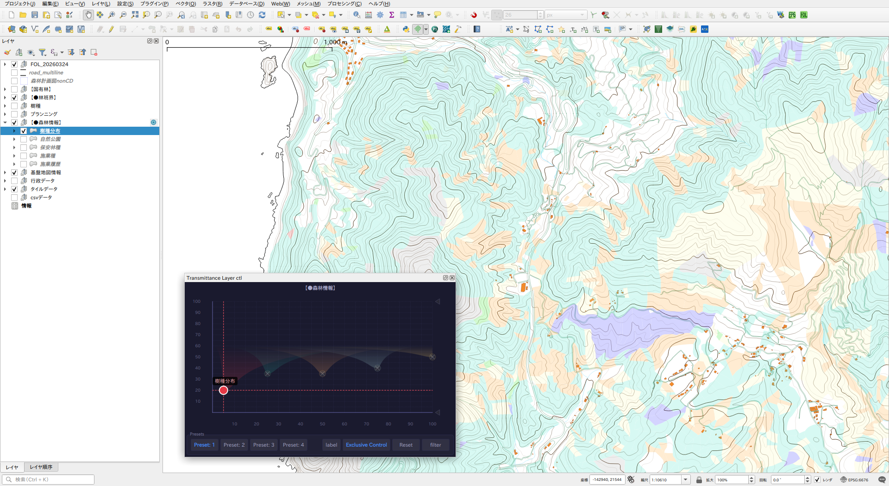
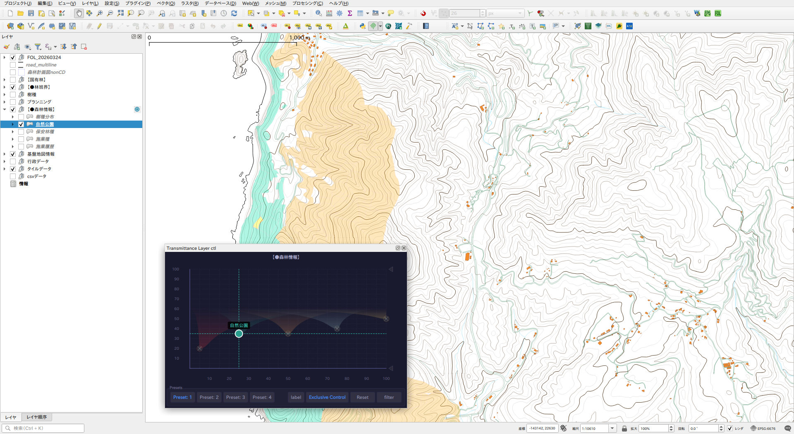
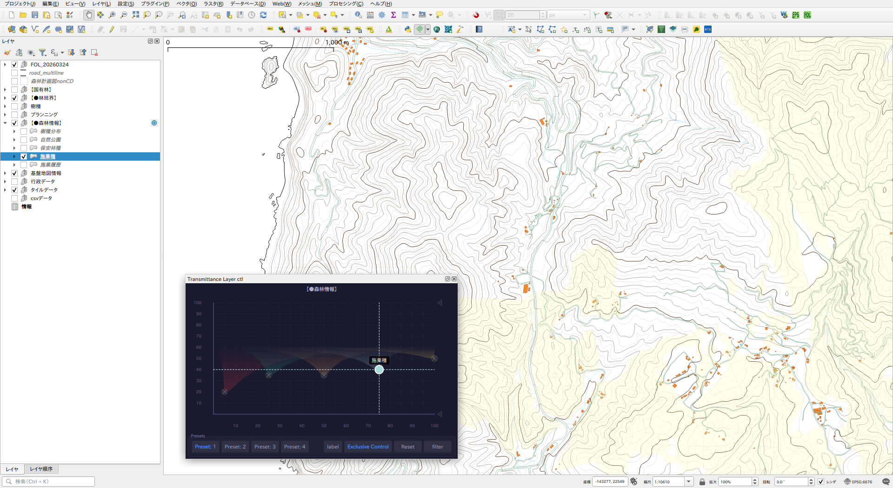
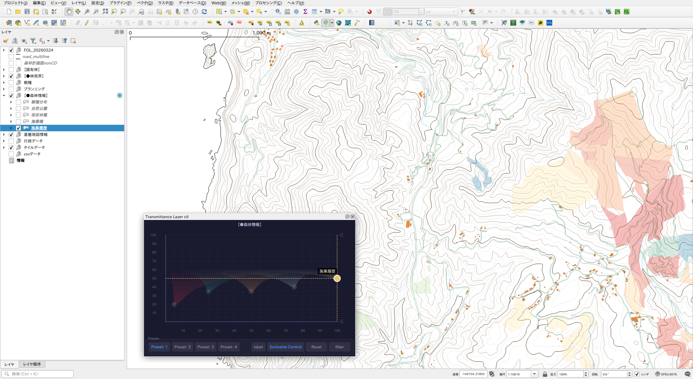

# Transmittance Layer ctl

A QGIS plugin that groups multiple layers and controls their opacity, stacking order, and label visibility in real time — making them function as one blended layer.

---

## Overview

Tag any QGIS layer group as a **Transmittance Group**. An indicator button appears next to the group in the layer panel. Click it to open the control panel and interactively adjust each layer's opacity and position using a 2D canvas.

| Panel — basic operation | Adjusting opacity and order |
|---|---|
|  |  |

| Multiple layers | Dragging a point |
|---|---|
|  |  |

---

## Requirements

- QGIS 3.16 or later

---

## Installation

1. Download the ZIP from the [releases page](https://github.com/raw-slnc/transmittance_layer_ctl/releases).
2. In QGIS: **Plugins → Manage and Install Plugins → Install from ZIP**.
3. Enable *Transmittance Layer ctl* in the plugin list.

---

## Setup

1. Right-click a layer group in the **Layers panel**.
2. Select **Mark as Transmittance Group**.
   - A small indicator button (◎) appears next to the group.
3. Click the indicator button to open the **Transmittance Layer ctl** panel.

---

## Control Panel

### Canvas

The 2D canvas plots each layer as a colored dot.

| Axis | Meaning |
|------|---------|
| **X** | Stacking order (left = bottom, right = top) |
| **Y** | Opacity (bottom = 0%, top = 100%) |

**Mouse operations on a dot:**

| Action | Result |
|--------|--------|
| Click | Toggle layer visibility on/off |
| Drag | Move position (X) and opacity (Y) simultaneously |
| Hover | Show layer name tooltip |

**Keyboard operations (while a dot is selected):**

| Key | Result |
|-----|--------|
| Up / Down | Opacity +/- 5% |
| Left / Right | Move stacking order left/right |

---

### Label indicator (△)

The **△** symbol below the X axis marks which layer's QGIS label is currently displayed. Drag it left or right to change the target layer.

- Arrow keys move △ when it is selected (click to select).
- The **label** button shows or hides △ and toggles the target layer's QGIS label on/off.

---

### Clamp (◁ markers on Y axis)

Two **◁** markers on the right Y axis define an opacity clamp range.

- Drag the upper ◁ to set the **maximum opacity**.
- Drag the lower ◁ to set the **minimum opacity**.
- Enable clamping with the **filter** button — all layers' opacity values are clamped to the range without changing their relative positions.

---

### Bottom buttons

| Button | Function |
|--------|----------|
| **Preset 1–4** | Save / load canvas states. **Long-press** = save current state. **Click** = apply saved state (click again to deactivate). **Right-click** = delete preset. |
| **label** | Toggle label display for the △ target layer. |
| **Exclusive Control** | Switch to Exclusive Control mode (see below). |
| **Reset** | Reset all layers to equal spacing on X and 60% opacity. |
| **filter** | Toggle opacity clamping on/off. |

---

## Exclusive Control Mode

Activate with the **Exclusive Control** button.

| Selecting a layer | Switching layers |
|---|---|
|  |  |

| Another layer | Yet another layer |
|---|---|
|  |  |

In this mode:

- **Click a dot** → only that layer becomes visible and its QGIS label is displayed; all other layers are hidden.
- **Left / Right arrow keys** → cycle through layers one by one.
- Clicking the canvas background does **not** deselect the current layer.
- The **label** button state is respected — if labels are off, they remain off even when switching layers.

---

## Presets

Up to **4 presets** can be saved per project. Each preset stores:

- Opacity and position of every layer
- Stacking order
- Clamp range and enabled state
- Exclusive Control on/off

Presets are saved inside the QGIS project file (`.qgs` / `.qgz`) and are restored when the project is reopened.

---

## Support

If this plugin is helpful for your work, you can support the development here:
https://paypal.me/rawslnc

## License

GNU General Public License v2.0 — see [LICENSE](LICENSE).

## Author

Copyright (C) 2026 Hideharu Masai
